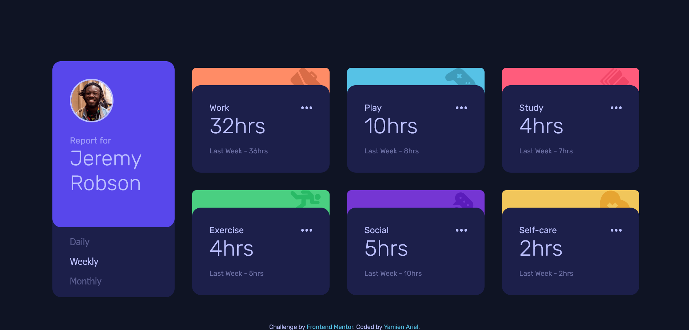

# Frontend Mentor - Time tracking dashboard solution

This is a solution to the [Time tracking dashboard challenge on Frontend Mentor](https://www.frontendmentor.io/challenges/time-tracking-dashboard-UIQ7167Jw). Frontend Mentor challenges help you improve your coding skills by building realistic projects. 

## Table of contents

- [Overview](#overview)
  - [The challenge](#the-challenge)
  - [Screenshot](#screenshot)
  - [Links](#links)
- [My process](#my-process)
  - [Built with](#built-with)
  - [Additional details](#Additional-details)
  - [What I learned](#what-i-learned)
  - [Continued development](#continued-development)
  - [Useful resources](#useful-resources)
- [Author](#author)
- [Acknowledgments](#acknowledgments)


## Overview

### The challenge

Users should be able to:

- View the optimal layout for the site depending on their device's screen size 
- See hover states for all interactive elements on the page
- Switch between viewing Daily, Weekly, and Monthly stats

### Screenshot




### Links

- Solution URL: [GitHub](https://github.com/ariel172/time-tracking-dashboard)
- Live Site URL: [Vercel](https://time-tracking-ariel.vercel.app/)

## My process

### Built with

- Semantic HTML5 markup
- SCSS with custom properties (variables)
- Flexbox
- CSS Grid
- Mobile-first workflow
- JavaScript (DOM manipulation)
- JSON (for dynamic data)

#### Additional details

- BEM-like class naming convention
- SASS partials and `@use` modules
- Vanilla JS (no framework)
- Responsive design (Desktop & Mobile)

### What I learned

This project helped me reinforce several core front-end development concepts. Here are some of the key takeaways:

- **DOM manipulation with JavaScript**  
  I learned how to dynamically create and inject HTML elements using `createElement`, `appendChild`, and how to manage state using event listeners.

- **Using JSON as a data source**  
  I practiced fetching and parsing data from a local `data.json` file and using it to populate the UI dynamically based on user interaction.

- **Responsive layout with CSS Grid and Flexbox**  
  I built the layout using a mobile-first approach. I used Flexbox for stacking elements vertically and CSS Grid to create a multi-column desktop layout.

- **SCSS architecture with partials and `@use`**  
  I structured my SCSS into partial files (base, components, layout), reused variables, and practiced modular styling.

- **Managing class states in JavaScript**  
  I implemented logic to activate/deactivate buttons by dynamically adding and removing classes using `classList`.

- **Handling small UI details**  
  I positioned SVG icons with `position: absolute`, adjusted responsive sizing, and fixed height issues to prevent layout shifts on different timeframes.


### What I learned

This project helped me reinforce several core front-end development concepts. Here are some examples:

- **Creating DOM elements dynamically with JavaScript**

```js
const divActivity = document.createElement("div");
divActivity.classList.add("activity", titre);
activityCards.appendChild(divActivity);
btnTimeframes.forEach((btn) => {
  btn.classList.remove("active");
});
e.target.classList.add("active");

activityCards.innerHTML = "";
timeFramesData(periode);

```


### Continued development

While building this project, I identified several areas where I would like to improve and explore further in future projects:

- **Cleaner JavaScript logic**  
  My current approach works but could be improved with more reusable functions and better separation of concerns. I’d like to explore patterns like MVC or component-based architecture in vanilla JS.

- **Improved accessibility and semantic structure**  
  In future projects, I want to pay more attention to ARIA roles, better HTML semantics, and keyboard navigation.

- **Animations and transitions**  
  I didn’t include animations between time changes (e.g., smooth fading or number transitions). I’d like to learn how to add subtle but effective UI animations using CSS or JavaScript.

- **Responsive design refinement**  
  Even though I used a mobile-first approach, I want to refine my media queries and grid logic to be more fluid and adaptable to more screen sizes.

- **Build tools and automation**  
  I used SCSS manually. In future projects, I’d like to set up a more automated environment with tools like Vite or Webpack and use `npm scripts` for compiling SCSS.


### Useful resources

- [OpenClassrooms – Build dynamic web pages with JavaScript](https://openclassrooms.com/en/courses/7172016-build-dynamic-web-pages-with-javascript)  
  I used this course to review core DOM manipulation techniques, such as creating elements, handling events, and updating the UI based on user interaction. It really helped me understand how to structure my JavaScript without using a framework.

- [OpenClassrooms – Learn to program with JavaScript](https://openclassrooms.com/en/courses/5664271-learn-to-program-with-javascript)  
  This course was helpful for reinforcing JavaScript fundamentals like variables, functions, conditionals, and loops. I referred back to it a few times when I got stuck with logic or needed to clarify syntax.

- [MDN Web Docs](https://developer.mozilla.org/en-US/)  
  My go-to reference for anything related to HTML, CSS, and JavaScript. I consulted it for things like `createElement`, `classList`, `fetch`, and responsive design best practices.


## Author

- Website - [Yamien Ariel](https://github.com/ariel172)
- Frontend Mentor - [@ariel172](https://www.frontendmentor.io/profile/ariel172)
- Codepen - [@yamienariel](https://codepen.io/yamienariel)

## Acknowledgements

Many thanks to the Frontend Mentor Discord community for their helpful advice, encouragement and shared passion for learning. I found inspiration and support by reading other people's solutions.  
It's great to be part of such a positive and collaborative environment!